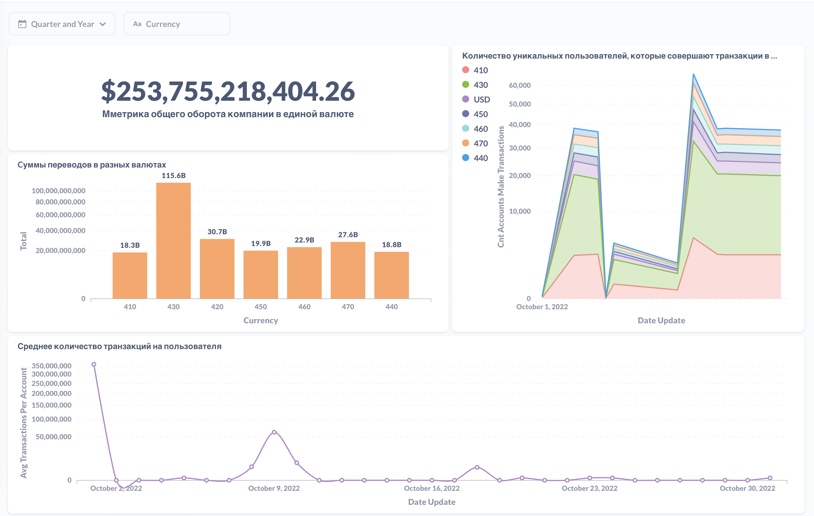

# Итоговый проект

### Описание
Репозиторий предназначен для сдачи итогового проекта.

### Структура репозитория

Внутри `src` расположены папки:

- `/src/dags`
	* `init_dag.py` - это даг который нужно запустить 1 раз - он создаст структуру таблиц в БД.
	* `fin_proj.py` - Даг который переносит файлы из Postgresql и кладет их в Vertica, этот же даг обновляет и витрину, посчитал что так удобнее - задача на обновление витрины запускается сразу после подгрузки данных. Все выполнено с учетом идемподентности.
- `/src/img` - здесь скриншот реализованного над витриной дашборда.

Все параметры подключения в коде - чтоб удобнее проверять

Схема в которой лежит витрина - `L4244YANDEXRU__DWH`

Сама витрина называется `global_metrics`

`+` Добавил docker-compose чтоб файл сертификата сразу закидывать в папку с дагами

## Скрин дашборда

Не пойму почемуто на платформе не показывает что есть картинка
Вот ссылка на репу - в ней все есть
https://github.com/andrewkomkov/de-project-final